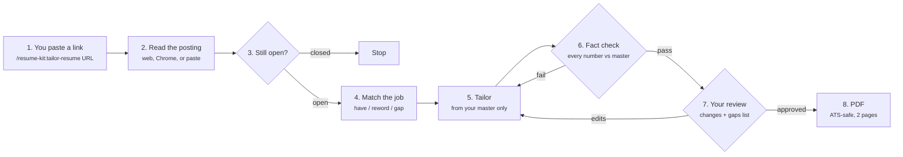

# Resume Kit

Give Claude a job posting link. It tailors your resume to that job from your own content and nothing else, shows you every change, and makes an ATS-safe PDF once you approve.

**What you need:** a Claude Pro or Max plan, the Claude desktop app (or Claude Code in a terminal), Google Chrome or Microsoft Edge, Python 3, and about 20 minutes for the first setup. No API key and no coding.

## How it works



Diamonds are checkpoints. Nothing moves past them without passing, or without your OK.

## One-time setup

### 1. Check your Claude plan
Go to claude.ai, then Settings, then Billing. You need **Pro** or **Max**. The free plan does not include Claude Code, which this kit runs on. Pro is enough.

### 2. Install the Claude desktop app
Download it from [claude.ai/download](https://claude.ai/download) (Mac or Windows) and sign in with your claude.ai account. Signing in is all it takes. There is no key to copy anywhere.

### 3. Check that Python is installed
The fact check and the PDF maker use it.

- **Mac:** open Terminal and type `python3 --version`. If it offers to install developer tools, click Install and wait for it to finish.
- **Windows:** install Python 3 from [python.org/downloads](https://www.python.org/downloads/) and tick **Add Python to PATH** on the first screen.

### 4. Install the plugin
In the Claude desktop app, click the **Code** tab and start a session in any folder. Then type these two lines, one at a time:

```
/plugin marketplace add firas-taiem/claude-plugins
/plugin install resume-kit@firas-taiem
```

You can also click the **+** button next to the prompt box, choose **Plugins**, and find it there. Either way, the plugin is now part of your Claude account and works in any folder you open.

### 5. Make your Resume Kit folder
Create a folder called `Resume Kit` in your Documents folder. Put your master resume in it as a markdown file named `Resume - Your Name.md`.

- If you already have one in this format, drop it in.
- If not, copy [`template/Resume - Your Name.md`](template/Resume%20-%20Your%20Name.md) into the folder, open the Code tab on the folder, and ask Claude: *"Convert my attached resume into the format of the template, word for word, and save it as Resume - <your name>.md."* Attach your current resume (Word or PDF). Read the result before you use it.

The folder ends up looking like this:

```
Documents/Resume Kit/
  Resume - Your Name.md      your master resume (the only source of facts)
  jobs/                      one folder per job, created for you
```

### 6. Optional: connect Chrome for LinkedIn postings
LinkedIn only shows job descriptions to signed-in users, so Claude reads them through your own Chrome. Install the **Claude in Chrome** extension from the Chrome Web Store and sign in. If you skip this, the kit still works: for a LinkedIn job, Claude asks you to paste the description instead.

### 7. Do a test run
Open `Documents/Resume Kit` in the Code tab (choose **Local**, then **Select folder**) and paste any job link:

```
/resume-kit:tailor-resume https://jobs.example.com/director-12345
```

The first time Claude runs one of the kit's scripts, it asks your permission. Choose **Allow**.

## Everyday use

1. Open the Claude desktop app, click the Code tab, and select your `Resume Kit` folder.
2. Type `/resume-kit:tailor-resume` followed by the job link (or paste the job description after it).
3. Read the change list and the gaps list. Reply "approve", or give edits in plain words, like "put the platform migration bullet first" or "drop the offshore line."
4. Open the PDF in the job's folder and upload it to the application.

Each job gets its own folder in `jobs/` with four files: the job description as it read on the day you applied, the tailored resume in markdown, the PDF, and the change list.

## The rules Claude follows

These are written into the skill, and the fact check enforces the key ones automatically.

**Allowed**
- Reorder bullets and achievements so the ones this job cares about come first.
- Drop or shorten lines to fit two pages.
- Use the job's wording for something you already did, as long as the claim stays the same.
- Pick the headline title from the titles already in your own headline.
- Build the summary from sentences already in your resume.
- Reorder the Core Competencies.

**Never**
- Add a skill, tool, number, employer, title, date, certification or award that is not in your master.
- Change what a claim says. "Led" stays "led"; "supported" never becomes "owned."
- Round or combine numbers.
- Change employers, job titles, dates, company descriptions, education, or the section order.
- Add buzzwords that are not already in your resume or the posting.
- Edit your master resume.
- Make the PDF before you approve.

**The gaps list.** If the job asks for something your resume does not show, Claude lists it as a gap and leaves it out of the resume. If it is true and simply missing, add it to your master in your own words. From then on, every tailored version can use it.

### How the fact check works
Before you see anything, `check_claims.py` compares the tailored resume against your master. Every number, percentage, dollar amount, year, organization name, certification and award in the tailored version has to appear in the master, and the employer lines, titles, dates, company descriptions and education have to match exactly. If one does not, the run stops and shows you the line. That catches added facts mechanically. What a script cannot catch is a quiet change of meaning with no new number in it, like "led" becoming "built." That is why the change list puts every edited line next to the master line it came from: a two-minute read of it is the second half of the check.

## Keeping your master current

`Resume - Your Name.md` is the only source. It is a plain text file, and you can edit it in the Code tab or any text editor. Make every change there: new roles, new wins, corrected wording. Tailored versions are built fresh from it each time, so never make fixes in a tailored copy. The next run will not see them.

| Markdown | What it becomes in the PDF |
|---|---|
| `## SECTION NAME` | Section heading |
| `### COMPANY \| City` | Employer line, city right-aligned |
| `**Title \| 2022 – 2026**` | Job title and dates, bold, dates right-aligned |
| `*text*` | Italic (company descriptions) |
| `- **Label:** text` | Bullet with a bold run-in label |

## If something goes wrong

| What you see | What to do |
|---|---|
| `/resume-kit:tailor-resume` is not recognized | Run `/plugin install resume-kit@firas-taiem` again, then start a new session. |
| "No master resume found" | The folder you opened has no `Resume - <Name>.md` at its top level. Open your `Resume Kit` folder itself, not Documents or a subfolder. |
| It cannot read the job page | Paste the job description text into the chat. That always works. |
| The fact check stopped the run | Read the line it flagged. If the fact is true and missing from your master, add it to the master and run again. If it is not true, tell Claude to remove it. |
| "python3: command not found" | On Windows this is normal, and Claude switches to `python` or `py` by itself. If none work, repeat setup step 3. |
| PDF error about Chrome or Edge | Install Google Chrome. The tailored markdown is already saved, so nothing is lost. |
| Asked for an API key | Never needed. Sign in with your claude.ai account. |

## Updating
When a new version is published, Claude Code tells you at the start of a session. Type `/plugin marketplace update firas-taiem` and then `/reload-plugins`. Your resume and job folders are yours and are never touched by an update.

## Privacy
Everything runs on your computer. Your resume is read from your own folder, the job posting is fetched from the URL you give, and the PDF is made by your own Chrome. Nothing in this plugin sends your resume anywhere.
